# Lab5Web

## PENGANTAR JAVASCRIPT

 - Javascript adalah bahasa pemrograman yang awalnya dirancang untuk berjalan di atas browser. Namun, seiring perkembangan zaman, javascript tidak hanya berjalan di atas browser saja. Javascript juga dapat digunakan pada sisi Server, Game, IoT, Desktop, dsb.<br>
 - Nama resmi JavaScript adalah ECMAScript. ECMAScript dikembangkan oleh ECMA Organization. ECMA-262 adalah standar resmi JavaScript. Diciptakan oleh Brendan Eich. Muncul pertama kali di semua browser Netscape dan Microsoft pada tahun 1996. Disetujui sebagai standar internasional pada tahun 1998.
 - JavaScript digunakan untuk memprogram perilaku halaman web, diantaranya adalah:
    1. Dapat Mengubah Konten HTML
    2. Dapat Mengubah Nilai Atribut HTML
    3. Dapat Mengubah Gaya HTML (CSS)
    4. Dapat Menyembunyikan Elemen HTML
    5. Dapat Menampilkan Elemen HTML
    <br>
 - Dalam HTML, kode JavaScript disisipkan di antara tag **script** dan **/script**. Script dapat diletakkan pada tag **head** atau **body**, atau dapat juga diletakkan pada keduanya. JavaScript juga dapat diletakkan pada file external.

 ## LANGKAH-LANGKAH PRAKTIKUM

1. Membuat file HTML dan bikin seperti berikut.
    ```html
    <!DOCTYPE html>
    <html lang="en">
    <head>
        <title>Mengenal JavaScript</title>
    </head>

    <body>
        <h1>Pengenalan JavaScript</h1>
        <h3>Contoh document.write dan console.log</h3>
        <script>
            document.write("Hello World");
            console.log("Hello World");
        </script>

    </body>

    </html>
    ```

    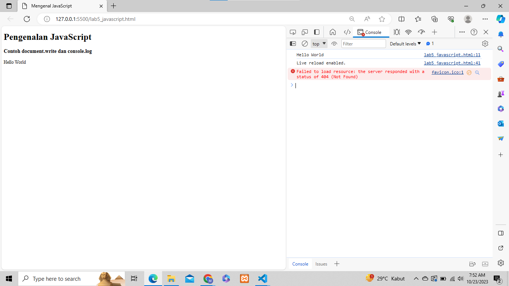<br>

2. Pemakaian Alert ssebagai property window.
    ```html
    <html>
    <head>
        <title>
            alert box
        </title>
    </head>

    <body>
        <script lang="javascript">
            !--
            window.alert("ini merupakan pesan untuk anda");
            //-->
        </script>
    </body>
    </html>
    ```
    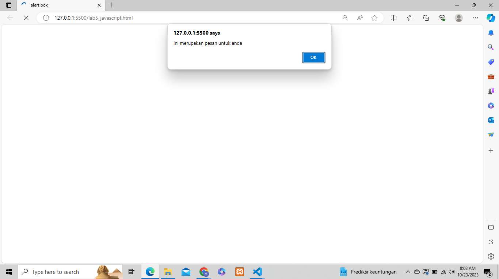<br>

3. Pemakaian method dalam objek.

    ```html
    <html>
    <head>
        <title>Skrip JavaScript</title>
    </head>

    <body>
        Percobaan memakai javascript:<br>
        <script lang="javascript">
            <!--
            document.write("Selamat Mencoba JavaScript<br>");
            document.write("Semoga Sukses");
            //-->
        </script>
    </body>
    </html>
    ```

    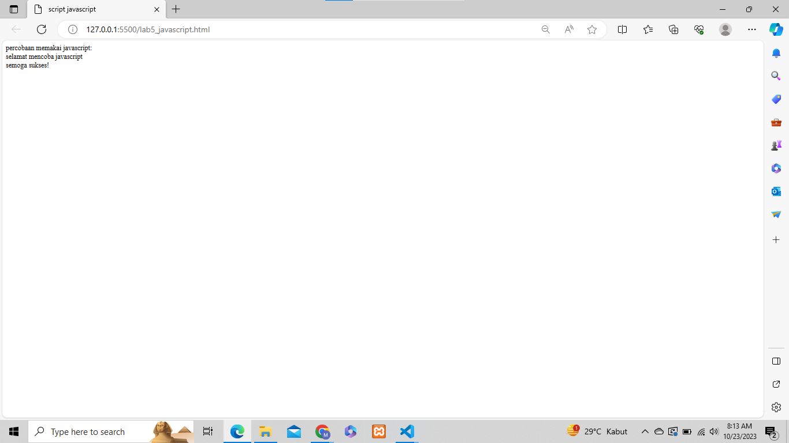<br>

4. Pemakaian Prompt

    ```html
    <html>
    <head>
        <title>Pemasukan data</title>
    </head>

    <body>
        <script lang="javascript">
            var nama = prompt("Siapa Nama Anda?", "Masukkan nama anda");
            document.write("Hai, " + nama);
        </script>
    </body>
    </html>
    ```

    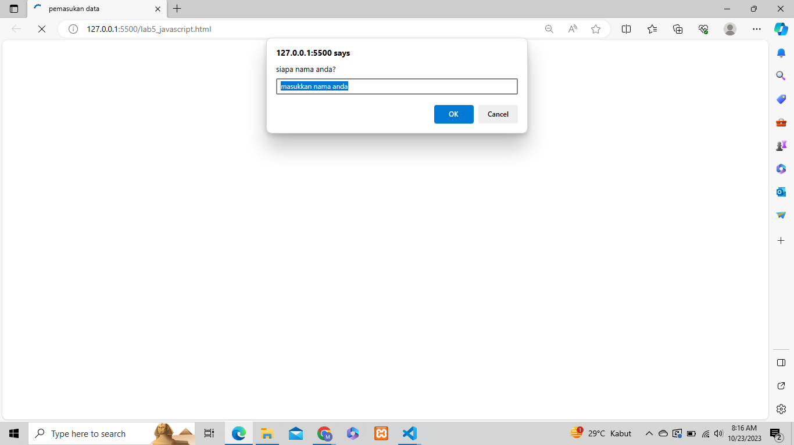<br>
    <br>
    **HASIL**<br>
    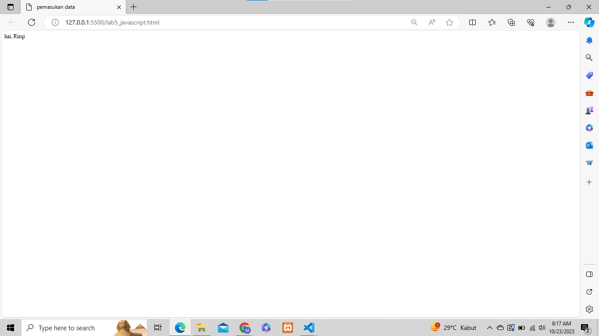<br>

5. Pembuatan fungsi dan cara pemanggilannya.

    ```html
    <html>
    <head>
        <title>Program</title>
        <script lang="javascript">
            function pesan() 
            {
                alert("Memanggil JavaScript lewat body onload")
            }
        </script>
    </head>

    <body onload=pesan()>
    </body>
    </html>
    ```

    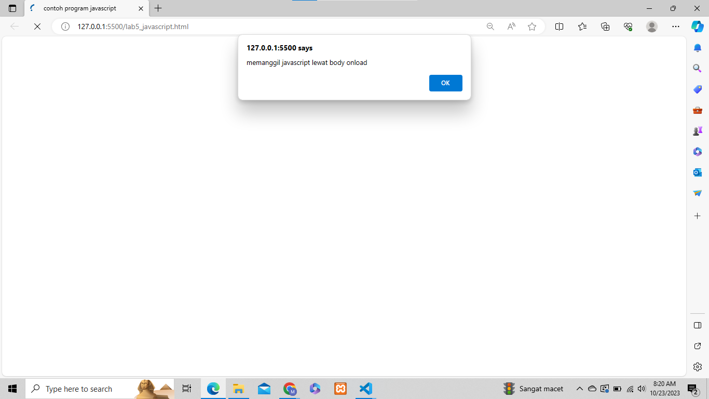<br>

6. Operasi dasar aritmatika.

    ```html
    <html>
    <head>
        <title>Program Aritmatika</title>
        <script lang="javascript">
            function test(val1, val2) {
                document.write("<br>" + "Perkalian : val1*val2 " + "<br>")
                document.write(val1 * val2)
                document.write("<br>" + "Pembagian : val1*val2 " + "<br>")
                document.write(val1 / val2)
                document.write("<br>" + "Penjumlahan : val1*val2 " + "<br>")
                document.write(val1 + val2)
                document.write("<br>" + "pengurangan : val1*val2 " + "<br>")
                document.write(val1 - val2)
                document.write("<br>" + "Modulus : val1*val2 " + "<br>")
                document.write(val1 % val2)
            }
        </script>
    </head>
    <body>
        <input type="button" name="button1" value="aritmethic" onclick=test(10,5)>
    </body>
    </html>
    ```

    <br>
    <br>
    **HASIL**<br>
    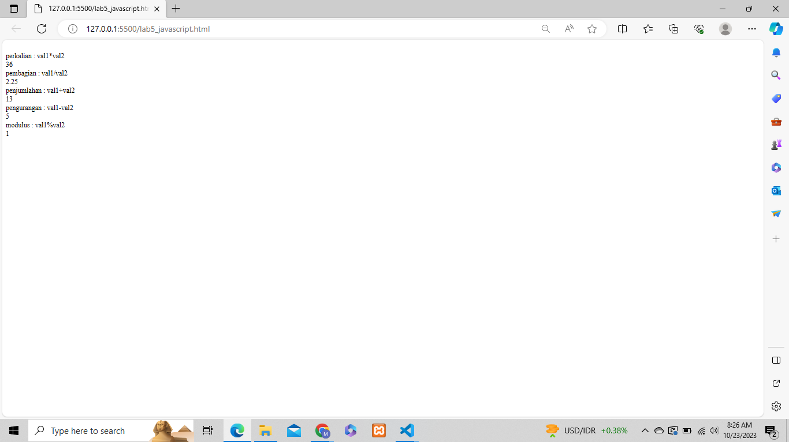<br>

7. Seleksi kondisi IF & ELSE.

    ```html
    <html>
    <head>
        <title>contoh if-else</title>
    </head>
    <body>
        <script lang="javascript">
            var nilai = prompt("Nilai (0-100): ", 0);
            var hasil = "";
            if (nilai >= 60)
                hasil = "Lulus";
            else
                hasil = "Tidak Lulus";
            document.write("Hasil: " + hasil);
        </script>
    </body>
    </html>
    ```

    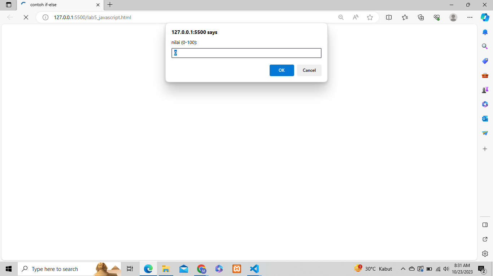<br>
    <br>
    **HASIL**<br>
    <br>

8. Penggunaan operator switch untuk seleksi kondisi.

    ```html
    <html>
    <head>
        <title>Operator Switch</title>
        <script lang="javascript">
            function test() {
                val1 = window.prompt("Input Nilai (1-5) :")
                switch (val1) {
                    case "1":
                        document.write("Bilangan Satu")
                        break
                    case "2":
                        document.write("Bilangan Dua")
                        break
                    case "3":
                        document.write("Bilangan Tiga")
                        break
                    case "4":
                        document.write("Bilangan Empat")
                        break
                    case "5":
                        document.write("Bilangan Lima")
                        break
                    default:
                        document.write("Bilangan Lainnya")
                }
            }
        </script>
    </head>
    <body>
        <input type="button" name="button" value="button" onclick=test()>
    </body>
    </html>
    ```

    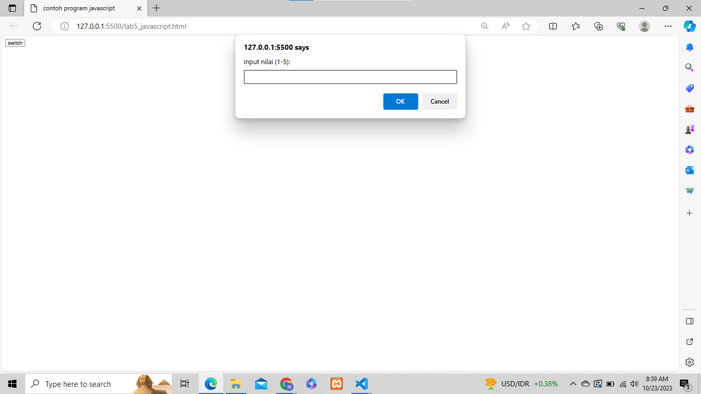<br>
    <br>
    **HASIL**<br>
    <br>

9. Pembuatan FORM, **FORM INPUT**

    ```html
    <html>
    <head>
        <title>Form Input</title>
        <script lang="javascript">
            function test() {
                var val1 = document.kirim.T1.value
                if (val1 % 2 == 0)
                    document.kirim.T2.value = "Bilangan Genap"
                else
                    document.kirim.T2.value = "Bilangan Ganjil"
            }
        </script>
    </head>
    <body>
        <form method="POST" name="kirim">
            <p>
                BILL <input type="text" name="T1" size="20"> MERUPAKAN BILL <input type="text" name="T2" size="20"></p>
            <p><input type="button" value="TEBAK" name="B1" onclick=test()></p>
        </form>
    </body>
    </html>
    ```

    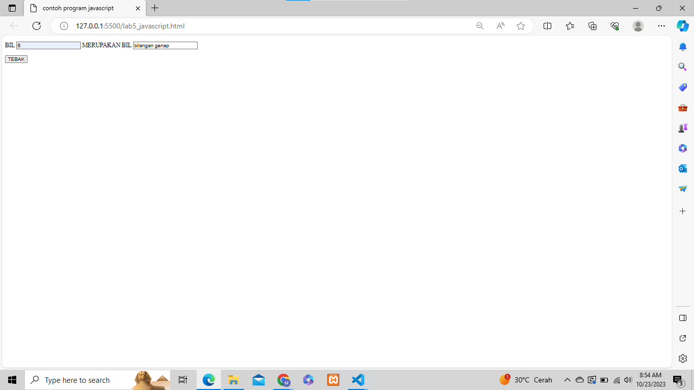<br>

10. Pembuatan Form, **FORM BUTTON**.

    ```html
    <html>
    <head>
        <title>Object Document</title>
    </head>
    <body>
        <script lang="javascript">
            function ubahwarnaLB(warna) {
                document.bgColor = warna;
            }

            function ubahwarnaLD(warna) {
                document.bgColor = warna;
            }
        </script>
        <h1>Test</h1>
        <form>
            <input type="button" value="Latar Belakang Hijau" onclick="ubahwarnaLB('Green')">
            <input type="button" value="Latar Belakang Putih" onclick="ubahwarnaLB('White')">
            <input type="button" value="Teks Kuning" onclick="ubahwarnaLB('YELLOW')">
            <input type="button" value="Teks Biru" onclick="ubahwarnaLB('BLUE')">
        </form>
        <script lang="javascript">
            document.write("Dimodifikasi terakhir kapan" + "document.last modify")
        </script>
    </body>
    </html>
    ```

    <br>

11. HTML DOM, Pilihan menggunakan checkBox dengan perhitungan otomatis.

    ```html
    <html>
    <head>
        <title>Daftar Menu</title>
        <script>
            function hitung(ele) {
                var total = document.getElementById('total').value;
                total = (total ? parseInt(total) : 0);
                var harga = 0;

                if (ele.checked) {
                    harga = ele.value;
                    total += parseInt(harga);
                } else {
                    harga = ele.value;
                    if (total > 0)
                        total -= parseInt(harga);
                }
                document.getElementById('total').value = total;
            }
        </script>
    </head>
    <body>
        <h1>Daftar Menu Makanan</h1>
        <label><input type="checkbox" value="5000" id="Menu 1" onclick="hitung(this);" /> Ayam Goreng Rp.5.000</label><br>
        <label><input type="checkbox" value="500" id="Menu 2" onclick="hitung(this);" /> Tempe Goreng Rp.500</label><br>
        <label><input type="checkbox" value="2500" id="Menu 3" onclick="hitung(this);" /> Telur Dadar Rp.5.000</label><br>
        <strong>Total Bayar : Rp. <input id="total" type="text" /></strong>
    </body>
    </html>
    ```

    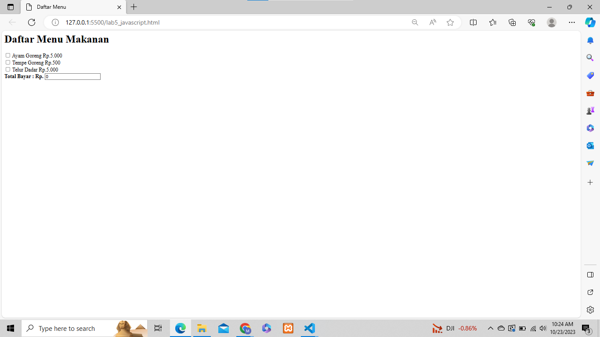<br>

## PERTANYAAN & TUGAS

1. Buat script untuk melakukan validasi pada isian form.<br>    

    ```html
    <html>
    <head>
        <title>Validasi Form</title>
        <style>
            .error {
            color: red;
            }
        </style>
    </head>
    <body>
        <h1>Formulir Validasi</h1>
        <form id="myForm" onsubmit="return validateForm()">
            <label for="nama">Nama:</label>
            <input type="text" id="nama" name="nama"><span id="namaError" class="error"></span><br>
            <label for="email">Email:</label>
            <input type="text" id="email" name="email"><span id="emailError" class="error"></span><br>
            <label for="umur">Umur:</label>
            <input type="text" id="umur" name="umur"><span id="umurError" class="error"></span><br>
            <br>
            <input type="submit" value="Submit">
        </form>
        <script>
            function validateForm() {
                var nama = document.getElementById("nama").value;
                var email = document.getElementById("email").value;
                var umur = document.getElementById("umur").value;
                var namaError = "";
                var emailError = "";
                var umurError = "";
            if (nama === "") {
                namaError = "Nama harus diisi";
            }
            if (email === "") {
                emailError = "Email harus diisi";
            } else if (!validateEmail(email)) {
                emailError = "Email tidak valid";
            }
            if (umur === "") {
                umurError = "Umur harus diisi";
            } else if (isNaN(umur) || umur < 0) {
                umurError = "Umur harus angka positif";
            }
            document.getElementById("namaError").innerHTML = namaError;
            document.getElementById("emailError").innerHTML = emailError;
            document.getElementById("umurError").innerHTML = umurError;
            if (namaError || emailError || umurError) {
                return false;
            }
                return true;
            }
            function validateEmail(email) {
                var re = /\S+@\S+\.\S+/;
                    return re.test(email);
            }
        </script>
    </body>
    </html>
    ```
    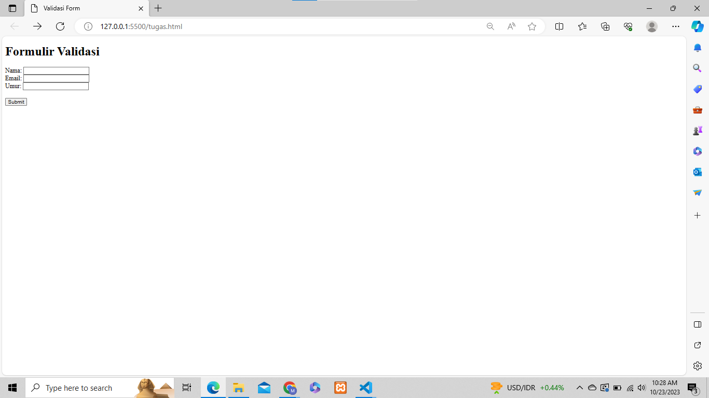 <br>